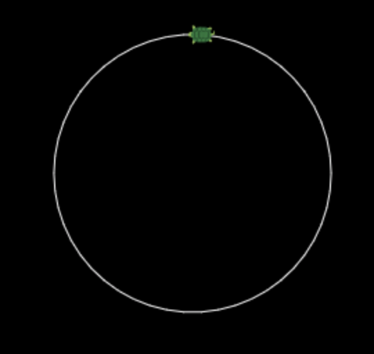

# マンガでわかるRuby1

マンガでわかるRuby1の内容を実践する

## 実行コマンド

```sh
$ bundle install --path vendor/bundle
$ bundle exec ruby kame.rb
```

## ソース

### 5角形

```ruby
n = 5

pen_down
n.times do
  forward 50
  turn_left(360 / n)
end
```


### 円

```ruby
n = 50

move_to(Math::PI * 100 / n, -100)
turn_left 90

pen_down
n.times do
  forward(Math::PI * 200 / n)
  turn_left(360 / n)
end
```



### n芒星

```ruby
x = -90
y = -90
offset = 70

list = [5, 7, 9, 21]

move_to(x, y)

list.each do |n|
  angle = 180 - 180 / n
  
  pen_down
  
  n.times do |i|
    forward 100
    turn_left angle
  
    if i == n - 1
      x += offset
      y += offset
      pen_up
      move_to(x, y)
    end
  end
end
```


